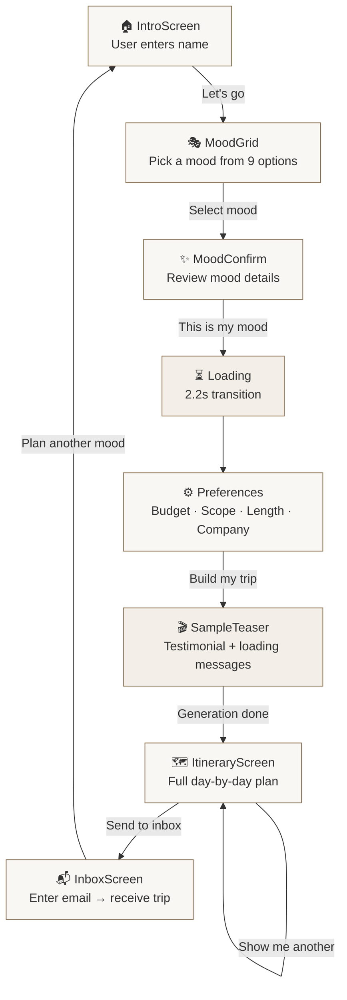
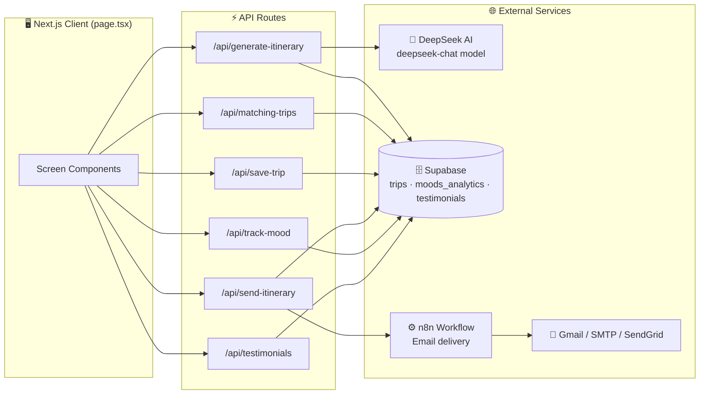
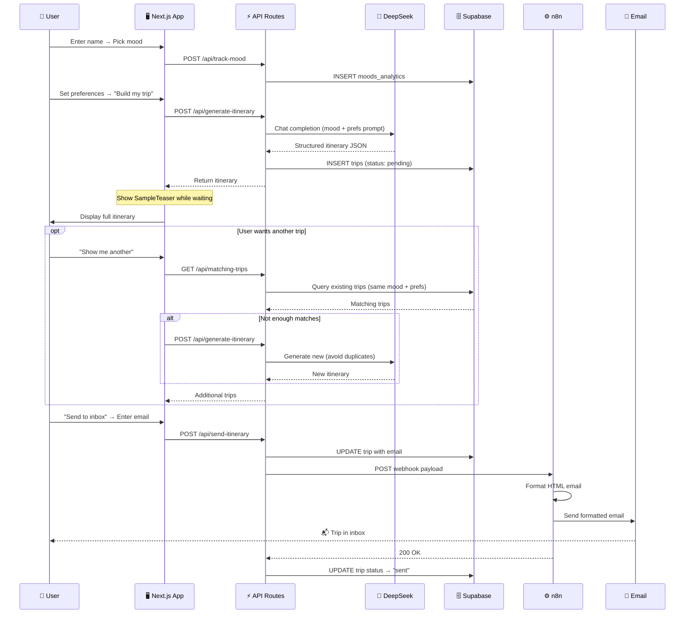

# WanderMood — Workflow Diagram

## User Flow

## System Architecture

## Data Flow (detailed)

## API Route Summary

| Route | Method | Input | Output | External Calls |
|-------|--------|-------|--------|----------------|
| `/api/generate-itinerary` | POST | moodId, moodName, preferences, existingTitles | `{ itinerary }` | DeepSeek AI, Supabase |
| `/api/matching-trips` | GET | mood, budget, scope, length, company | `{ trips[] }` | Supabase |
| `/api/save-trip` | POST | moodId, moodName, preferences, itinerary | `{ success }` | Supabase |
| `/api/send-itinerary` | POST | email, moodId, preferences, itinerary | `{ tripId }` | Supabase, n8n webhook |
| `/api/track-mood` | POST | moodId, sessionId | `{ success }` | Supabase |
| `/api/testimonials` | GET | mood | `{ testimonial }` | Supabase |
